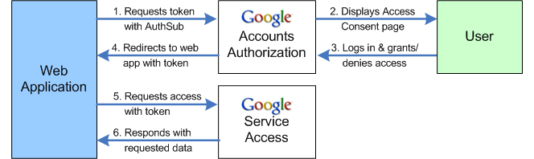

# LJ Code 401 - Week 7
[`Home`](../README.md) [`401 Index`](401_README.md)
<hr>

#### [Sorting](https://en.wikipedia.org/wiki/Sorting_algorithm) 

###### insertion sort
inserts each value into the new collection where it would be, navigating up or down

###### selection sort -> heap sort
uses a heap to select the smallest value and insert it into a new collection

###### bubble sort
inserts each value into the collection one at a time, if no values are moved, the sort stops

###### quick sort
divide and conquer, sort collection my division
```
5        11       13*        19        4       9
5 < 13* | 11 < 13* | 19 > 13* | 4 < 13* | 9 < 13*
9,    4,    11*,    5,    13,   19
            5, 4, 9, < 11* <      13, 19
            4* < 5 < 9
  [4, 5, 9, 11, 13, 19]
```
\* = pivot

###### merge sort
breaks down components and sorts the values one at a time
```
5        11       13    |    19        4       9
    5, 11, 13                     19, 4, 9
  5,      11, 13              19,       4, 9
        11      13                    4      9

  [11, 13]          |           [4, 9]        
  [5, 11, 13]       |           [4, 9, 19]        
  [4, 5, 9, 11, 13, 19]        
```

###### in-place
sorts the collection without creating a copy

###### stable
sorts the collection while keeping duplicates in the same order as they were

#### [CSS / SASS](http://sass-lang.com/guide)
`sass -- watch input.scss output.css`
`sass -- watch app/sass:public/stylesheets`

- partials - modularizing components (sass file with a leading underscore `_partial.scss`)
  - able to import them `@import 'partial';`

```
style
  | -core.scss
  lib
    | -base
        -_reset.scss
        -_base.scss
      -layout
        -_layout.scss
```
```
component
  | 
  navbar
    | -navbar.scss  -> import into core.scss
      -index.js
```

#### OAuth
- http ([302](en.wikipedia.org/wiki/HTTP_302)) redirection
- using outside resources for authentication
- still uses tokens and http
- login/signup using the same link

1. our link -> google
2. google -> google backend authentication
3. google auth sends hash-code -> our backend
4. our backend return code -> google backend
5. google sends token -> our backend
6. our backend sends google's token -> Google+
7. Google+ sends |email*,user,picture| -> our backend
8. our backend creates account in database with email and username

#### [Google-Developers](developers.google.com)
1. Google Api Console (at footer)
2. Select org
3. Create new Project
4. Set project name
5. Switch to project
6. Credentials -> Create
7. OAuth Client
8. Configure Consent Screen
9. Select Type -> web app
10. Name application and authorize origins
  - `localhost:8080`
11. Authorized redirect URIs
  - localhost:3000/oauth/google
12. Create 
  - save GOOGLE\_CLIENT\_ID=`key` and GOOGLE\_CLIENT\_SECRET=`id`
13. GoogleAPI dashboard -> enable API's
14. google plus API (`Google+ API`)
